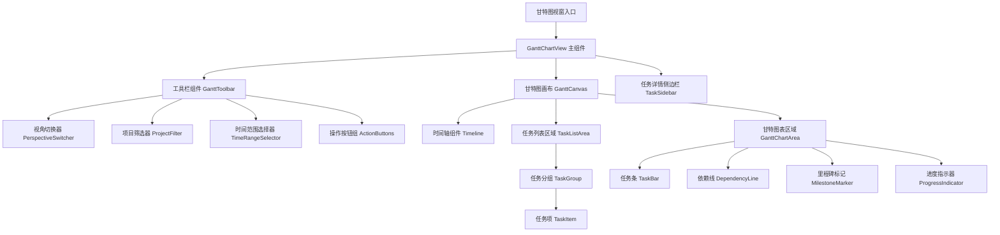
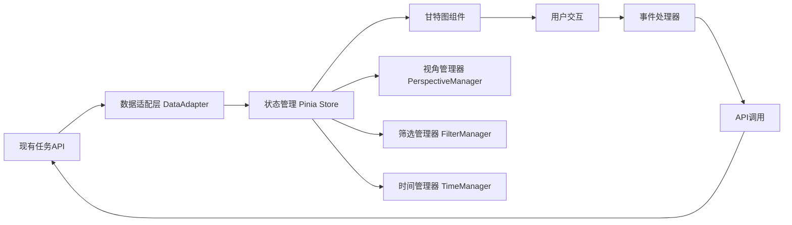

# 甘特图视窗功能设计文档

## 概述

甘特图视窗功能是一个基于时间轴的项目管理可视化工具，集成到现有的MiaowuTodo任务管理系统中。该功能提供直观的时间线视图，支持员工个人视角和团队管理视角的切换，帮助用户更好地规划、跟踪和管理项目任务。

设计采用Vue 3 + Element Plus技术栈，与现有系统保持一致，确保良好的用户体验和系统集成度。

## 架构设计

### 整体架构



### 数据流架构



## 组件设计和接口

### 主要组件结构

#### 1. GanttChartView (主组件)
```typescript
interface GanttChartViewProps {
  initialPerspective?: 'employee' | 'team'
  initialProjectIds?: number[]
  initialTimeRange?: TimeRange
}

interface GanttChartViewState {
  currentPerspective: 'employee' | 'team'
  selectedProjects: Project[]
  timeRange: TimeRange
  tasks: Task[]
  loading: boolean
  error: string | null
}
```

#### 2. GanttToolbar (工具栏组件)
```typescript
interface GanttToolbarProps {
  perspective: 'employee' | 'team'
  projects: Project[]
  selectedProjectIds: number[]
  timeRange: TimeRange
  onPerspectiveChange: (perspective: string) => void
  onProjectsChange: (projectIds: number[]) => void
  onTimeRangeChange: (range: TimeRange) => void
}
```

#### 3. GanttCanvas (甘特图画布)
```typescript
interface GanttCanvasProps {
  tasks: Task[]
  timeRange: TimeRange
  perspective: 'employee' | 'team'
  onTaskClick: (task: Task) => void
  onTaskDrag: (taskId: number, newDates: DateRange) => void
  onDependencyCreate: (fromTaskId: number, toTaskId: number) => void
}
```

#### 4. Timeline (时间轴组件)
```typescript
interface TimelineProps {
  startDate: Date
  endDate: Date
  granularity: 'day' | 'week' | 'month' | 'quarter'
  onDateClick: (date: Date) => void
}
```

#### 5. TaskBar (任务条组件)
```typescript
interface TaskBarProps {
  task: Task
  timeScale: TimeScale
  onTaskClick: (task: Task) => void
  onTaskDrag: (taskId: number, newDates: DateRange) => void
  onProgressUpdate: (taskId: number, progress: number) => void
}
```

### API接口设计

#### 甘特图数据接口
```typescript
// 获取甘特图任务数据
interface GanttTasksRequest {
  perspective: 'employee' | 'team'
  projectIds?: number[]
  userIds?: number[]
  startDate: string
  endDate: string
  includeCompleted?: boolean
}

interface GanttTasksResponse {
  tasks: GanttTask[]
  dependencies: TaskDependency[]
  milestones: Milestone[]
  totalCount: number
}

// 甘特图任务数据结构
interface GanttTask extends Task {
  startDate: string
  endDate: string
  progress: number
  dependencies: number[]
  assignees: User[]
  estimatedHours: number
  actualHours: number
  color: string
  position: {
    x: number
    y: number
    width: number
    height: number
  }
}
```

## 数据模型

### 核心数据结构

#### 时间范围模型
```typescript
interface TimeRange {
  startDate: Date
  endDate: Date
  granularity: 'day' | 'week' | 'month' | 'quarter'
}

interface TimeScale {
  pixelsPerDay: number
  startDate: Date
  endDate: Date
  totalDays: number
  viewportWidth: number
}
```

#### 任务依赖模型
```typescript
interface TaskDependency {
  id: number
  fromTaskId: number
  toTaskId: number
  type: 'finish-to-start' | 'start-to-start' | 'finish-to-finish' | 'start-to-finish'
  lag: number // 延迟天数
}
```

#### 视角配置模型
```typescript
interface PerspectiveConfig {
  type: 'employee' | 'team'
  groupBy: 'project' | 'user' | 'priority' | 'status'
  sortBy: 'startDate' | 'endDate' | 'priority' | 'progress'
  showCompleted: boolean
  showDependencies: boolean
  showMilestones: boolean
}
```

#### 甘特图配置模型
```typescript
interface GanttConfig {
  rowHeight: number
  columnWidth: number
  timelineHeight: number
  sidebarWidth: number
  colors: {
    taskBar: string
    completedTask: string
    overdueTask: string
    milestone: string
    dependency: string
    weekend: string
    today: string
  }
  dateFormats: {
    day: string
    week: string
    month: string
    quarter: string
  }
}
```

## 错误处理

### 错误类型定义
```typescript
enum GanttErrorType {
  DATA_LOAD_FAILED = 'DATA_LOAD_FAILED',
  TASK_UPDATE_FAILED = 'TASK_UPDATE_FAILED',
  DEPENDENCY_CONFLICT = 'DEPENDENCY_CONFLICT',
  INVALID_DATE_RANGE = 'INVALID_DATE_RANGE',
  PERMISSION_DENIED = 'PERMISSION_DENIED',
  NETWORK_ERROR = 'NETWORK_ERROR'
}

interface GanttError {
  type: GanttErrorType
  message: string
  details?: any
  timestamp: Date
}
```

### 错误处理策略

1. **数据加载失败**: 显示重试按钮，提供离线模式
2. **任务更新失败**: 回滚本地更改，显示错误提示
3. **依赖关系冲突**: 阻止操作，显示冲突详情和解决建议
4. **无效日期范围**: 自动修正到合理范围
5. **权限不足**: 隐藏相关功能，显示权限说明
6. **网络错误**: 启用离线缓存，定期重试同步

## 测试策略

### 单元测试
- 时间计算工具函数测试
- 数据转换和格式化函数测试
- 组件渲染和交互测试
- 状态管理逻辑测试

### 集成测试
- API接口调用测试
- 组件间数据传递测试
- 用户交互流程测试
- 错误处理机制测试

### 性能测试
- 大量任务数据渲染性能测试
- 滚动和缩放操作流畅度测试
- 内存使用和泄漏检测
- 网络请求优化效果测试

### 用户体验测试
- 不同屏幕尺寸适配测试
- 键盘导航和无障碍功能测试
- 多浏览器兼容性测试
- 用户操作习惯和反馈测试

## 正确性属性

*属性是一个特征或行为，应该在系统的所有有效执行中保持为真——本质上，是关于系统应该做什么的正式声明。属性作为人类可读规范和机器可验证正确性保证之间的桥梁。*

### 属性 1: 权限控制正确性
*对于任何*用户和甘特图视窗入口，当用户点击入口时，显示的任务应该仅包含该用户有权限查看的项目任务
**验证: 需求 1.1**

### 属性 2: 任务时间显示正确性
*对于任何*任务数据集，当甘特图加载完成时，每个任务在时间轴上的位置应该准确反映其开始时间、结束时间和当前进度
**验证: 需求 1.2**

### 属性 3: 截止时间标记显示
*对于任何*具有截止时间的任务，任务条上应该显示截止时间标记和剩余时间提醒
**验证: 需求 1.3**

### 属性 4: 超时任务视觉标识
*对于任何*超过截止时间的任务，任务条应该被标记为红色警告状态
**验证: 需求 1.4**

### 属性 5: 悬停提示显示
*对于任何*任务条，当用户悬停时应该显示包含任务详细信息的悬浮提示框
**验证: 需求 1.5**

### 属性 6: 视角切换功能
*对于任何*视角切换操作，当用户点击视角切换器时，界面应该正确切换到对应的视角模式
**验证: 需求 2.1, 3.1**

### 属性 7: 员工视角任务过滤
*对于任何*用户在员工视角下，显示的任务应该仅包含该用户作为负责人或参与者的任务
**验证: 需求 2.2**

### 属性 8: 员工视角任务排序
*对于任何*员工视角下的任务列表，任务应该按照优先级和截止时间进行排序显示
**验证: 需求 2.3**

### 属性 9: 任务状态突出显示
*对于任何*即将到期或超时的任务，在员工视角下应该被突出显示
**验证: 需求 2.4**

### 属性 10: 任务点击交互
*对于任何*任务条，当用户点击时应该打开对应的任务详情编辑界面
**验证: 需求 2.5**

### 属性 11: 团队视角任务分组
*对于任何*团队视角下的任务数据，任务应该按团队成员正确分组显示
**验证: 需求 3.2**

### 属性 12: 工作负载计算正确性
*对于任何*团队成员，在团队视角下应该正确显示其工作负载和任务分布
**验证: 需求 3.3**

### 属性 13: 任务拖拽重分配
*对于任何*具有权限的用户，在团队视角下应该能够通过拖拽重新分配任务
**验证: 需求 3.4**

### 属性 14: 资源冲突检测
*对于任何*存在任务冲突或资源过载的情况，应该显示相应的警告提示
**验证: 需求 3.5**

### 属性 15: 时间粒度切换
*对于任何*时间粒度选择操作，时间轴应该正确更新为对应的显示粒度（日、周、月、季度）
**验证: 需求 4.1**

### 属性 16: 时间范围过滤
*对于任何*选定的时间范围，甘特图应该仅显示该时间段内的任务
**验证: 需求 4.2**

### 属性 17: 项目筛选功能
*对于任何*项目筛选操作，应该允许选择单个或多个项目，并正确过滤显示对应的任务
**验证: 需求 4.3**

### 属性 18: 筛选条件应用
*对于任何*应用的筛选条件，甘特图应该仅显示符合所有筛选条件的任务和项目
**验证: 需求 4.4**

### 属性 19: 筛选重置功能
*对于任何*筛选条件清除操作，甘特图应该恢复显示所有用户有权限查看的任务
**验证: 需求 4.5**

### 属性 20: 依赖关系可视化
*对于任何*存在前置依赖关系的任务，应该绘制连接线正确显示任务间的依赖关系
**验证: 需求 5.1**

### 属性 21: 依赖线交互
*对于任何*依赖线，当用户点击时应该高亮显示相关的依赖任务
**验证: 需求 5.2**

### 属性 22: 依赖影响计算
*对于任何*前置任务的延期，应该自动计算并提示后续任务的影响范围
**验证: 需求 5.3**

### 属性 23: 依赖约束检查
*对于任何*任务时间调整操作，应该检查依赖关系并阻止不合理的时间调整
**验证: 需求 5.4**

### 属性 24: 依赖冲突处理
*对于任何*依赖关系冲突，应该显示冲突警告并提供解决建议
**验证: 需求 5.5**

### 属性 25: 虚拟滚动优化
*对于任何*大量任务数据的处理，应该采用虚拟滚动技术优化性能
**验证: 需求 6.3**

### 属性 26: 离线缓存机制
*对于任何*网络连接不稳定的情况，应该提供离线缓存和数据同步机制
**验证: 需求 6.5**

### 属性 27: 数据同步一致性
*对于任何*在甘特图中的任务修改，应该实时同步更新到任务管理列表视图
**验证: 需求 7.1**

### 属性 28: 反向数据同步
*对于任何*任务管理列表中的任务状态变化，甘特图应该自动更新对应任务条的显示状态
**验证: 需求 7.2**

### 属性 29: 任务创建接口调用
*对于任何*在甘特图中创建的新任务，应该调用现有的任务创建接口保存数据
**验证: 需求 7.3**

### 属性 30: 双击交互功能
*对于任何*任务条，当用户双击时应该打开现有的任务详情编辑弹窗
**验证: 需求 7.4**

### 属性 31: WebSocket通知机制
*对于任何*甘特图数据变更，应该触发WebSocket通知其他相关页面更新
**验证: 需求 7.5**

### 属性 32: 响应式滚动支持
*对于任何*界面空间不足的情况，应该提供水平和垂直滚动条支持大量数据显示
**验证: 需求 8.5**