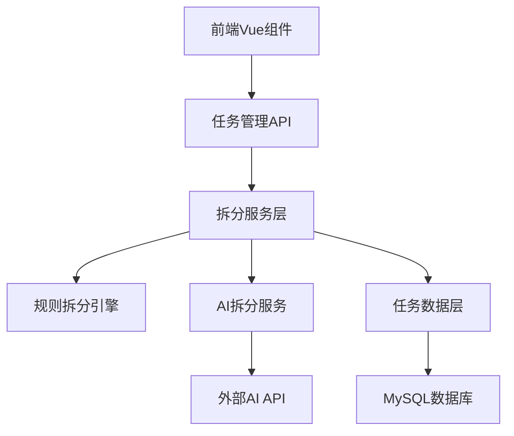

# 设计文档

## 概述

任务拆分子任务功能是一个智能任务管理系统，通过规则识别和AI分析两种方式，自动将复杂任务拆分为多个可管理的子任务。系统采用前后端分离架构，支持实时拆分预览和用户确认机制。

## 架构

### 系统架构图



### 技术栈
- **前端**: Vue 3 + Element Plus
- **后端**: Spring Boot + MyBatis
- **数据库**: MySQL
- **AI服务**: 外部AI API (可扩展)

## 组件和接口

### 前端组件

#### TaskSplitDialog 组件
- **功能**: 显示拆分结果和用户确认界面
- **属性**:
  - `visible`: 弹窗显示状态
  - `splitResult`: 拆分结果数据
  - `loading`: 加载状态
- **事件**:
  - `confirm`: 用户确认拆分
  - `cancel`: 用户取消拆分

#### TaskDetail 组件扩展
- **新增功能**: 拆分按钮
- **位置**: 任务详情页面底部操作区域

### 后端接口

#### TaskSplitController
```java
@RestController
@RequestMapping("/api/task-split")
public class TaskSplitController {
    
    @PostMapping("/analyze/{taskId}")
    public ResponseEntity<SplitAnalysisResult> analyzeTask(@PathVariable Long taskId);
    
    @PostMapping("/confirm")
    public ResponseEntity<List<Task>> confirmSplit(@RequestBody SplitConfirmRequest request);
}
```

#### 接口规范

**拆分分析接口**
- **URL**: `POST /api/task-split/analyze/{taskId}`
- **参数**: taskId (路径参数)
- **响应**:
```json
{
  "code": 200,
  "message": "分析成功",
  "data": {
    "canSplit": true,
    "splitType": "RULE_BASED",
    "subtasks": [
      {
        "title": "子任务1",
        "content": "具体内容",
        "order": 1
      }
    ]
  }
}
```

**确认拆分接口**
- **URL**: `POST /api/task-split/confirm`
- **参数**:
```json
{
  "taskId": 123,
  "subtasks": [
    {
      "title": "子任务1",
      "content": "具体内容",
      "order": 1
    }
  ]
}
```

## 数据模型

### 任务拆分结果 (SplitAnalysisResult)
```java
public class SplitAnalysisResult {
    private Boolean canSplit;           // 是否可拆分
    private SplitType splitType;        // 拆分类型
    private List<SubtaskInfo> subtasks; // 子任务信息
    private String reason;              // 不可拆分原因
}
```

### 子任务信息 (SubtaskInfo)
```java
public class SubtaskInfo {
    private String title;    // 子任务标题
    private String content;  // 子任务内容
    private Integer order;   // 排序序号
}
```

### 拆分类型枚举 (SplitType)
```java
public enum SplitType {
    RULE_BASED,    // 规则拆分
    AI_BASED,      // AI拆分
    NOT_SPLITTABLE // 不可拆分
}
```

## 正确性属性

*属性是一个特征或行为，应该在系统的所有有效执行中保持为真——本质上，是关于系统应该做什么的正式声明。属性作为人类可读规范和机器可验证正确性保证之间的桥梁。*

### 属性反思

在编写正确性属性之前，我需要审查预工作分析中识别的所有可测试属性，以消除冗余：

**冗余分析:**
- 属性1.1和1.2都涉及规则识别，可以合并为一个综合属性
- 属性2.1和2.2都涉及AI分析准备，可以合并
- 属性3.1和3.2都涉及用户界面交互，可以合并
- 属性4.1和4.2都涉及结果展示，可以合并

**合并后的核心属性:**

**属性 1: 规则拆分识别**
*对于任何* 包含数字标题格式（1、2、3等）的任务内容，系统应该能够正确识别并标记为可规则拆分状态
**验证: 需求 1.1, 1.2**

**属性 2: 内容分割一致性**
*对于任何* 包含多个数字标题的任务内容，系统拆分后的子任务数量应该等于识别到的标题数量
**验证: 需求 1.4**

**属性 3: AI分析路由**
*对于任何* 不包含明显数字标题格式的任务内容，系统应该将其路由到AI分析流程
**验证: 需求 2.1, 2.2**

**属性 4: 拆分结果完整性**
*对于任何* 成功的拆分操作，返回的结果应该包含拆分类型、子任务列表和必要的元数据
**验证: 需求 2.4, 4.2**

**属性 5: 用户交互一致性**
*对于任何* 已创建的任务，用户点击拆分按钮应该触发正确的API调用并返回拆分结果
**验证: 需求 3.1, 3.2, 3.4**

**属性 6: 子任务创建关联性**
*对于任何* 用户确认的拆分操作，创建的子任务应该与原任务建立正确的父子关联关系
**验证: 需求 4.4**

**属性 7: 错误处理鲁棒性**
*对于任何* 异常情况（AI服务不可用、输入异常、网络中断），系统应该提供适当的错误处理和用户提示
**验证: 需求 5.1, 5.2, 5.3, 5.4**

## 错误处理

### 异常类型和处理策略

1. **AI服务异常**
   - 超时处理: 15秒超时限制
   - 降级策略: 回退到规则拆分或提示用户稍后重试
   - 用户提示: "AI服务暂时不可用，请稍后重试"

2. **输入验证异常**
   - 空内容检查
   - 格式验证
   - 长度限制检查

3. **数据库异常**
   - 事务回滚
   - 数据一致性保护
   - 错误日志记录

4. **网络异常**
   - 重试机制: 最多3次重试
   - 指数退避策略
   - 用户状态保存

## 测试策略

### 单元测试
- 规则拆分引擎测试
- AI服务集成测试
- 数据访问层测试
- 错误处理测试

### 属性测试
- 使用JUnit 5 + QuickTheories进行属性测试
- 每个属性测试运行100次迭代
- 生成随机任务内容进行测试

**属性测试配置:**
```java
@Property
void testRuleSplitRecognition() {
    qt().forAll(taskContentWithNumberedTitles())
        .check(content -> {
            SplitAnalysisResult result = splitService.analyzeTask(content);
            return result.getCanSplit() && 
                   result.getSplitType() == SplitType.RULE_BASED;
        });
}
```

### 集成测试
- API端到端测试
- 前后端集成测试
- 数据库集成测试

### 测试数据生成器
- 随机任务内容生成器
- 数字标题格式生成器
- 异常情况模拟器